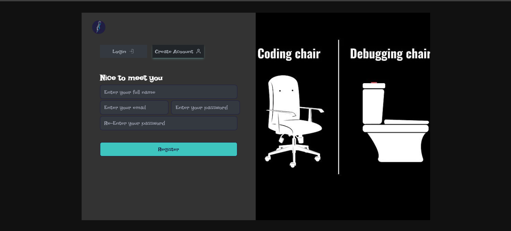
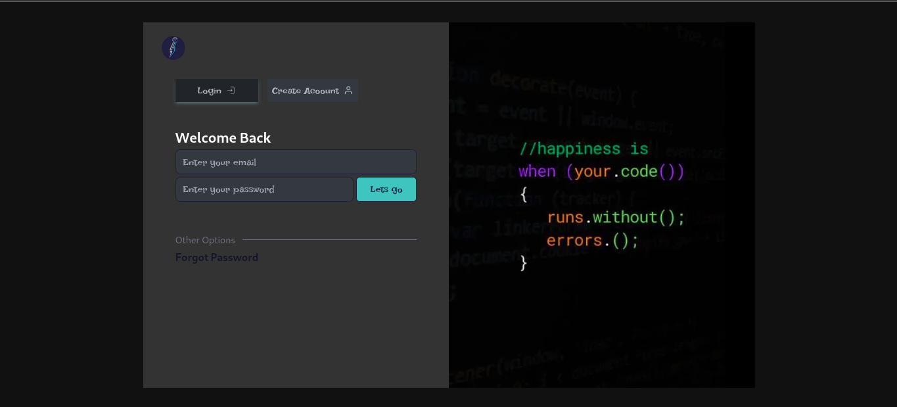
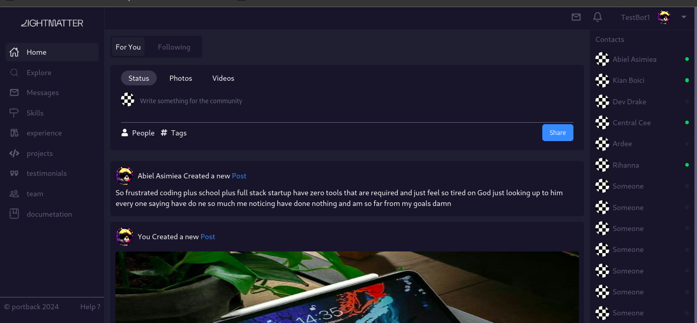

# PortBack: Portfolio Backend as a Service

PortBack is a versatile backend service tailored specifically for managing portfolios effortlessly. It offers developers a comprehensive platform to update and showcase their portfolios seamlessly. Moreover, it fosters a vibrant developer community, enabling users to connect, collaborate, and stay updated on fellow developers' activities.

## Key Features:

1. **Portfolio Management:**
   - Easily upload, organize, and update your portfolio content.
   - Intuitive interface for adding new projects, experiences, skills, and more.

2. **Developer Community:**
   - Connect with fellow developers, designers, and creators.
   - Follow other users to stay updated on their latest projects and activities.

3. **Customization:**
   - Tailor your portfolio to reflect your unique style and personality.

5. **API Integration:**
   - Integrate PortBack with your existing tools and workflows using our robust API.

## How to Use:

1. **Sign Up/Login:**
   - Create an account or log in to your existing account to get started.

2. **Portfolio Management:**
   - Upload your portfolio content, including projects, experiences, education, and skills.
   - Update your portfolio as needed, showcasing your latest work and achievements.

3. **Community Engagement:**
   - Explore the developer community to discover new talent and projects.
   - Follow other users to stay updated on their activities and collaborate on projects.

4. **Customization:**
   - Customize your portfolio to reflect with your favorite language and ui of your choice

5. **API Integration:**
   - Integrate PortBack with your website or application using our easy to use API documentation.

## Screenshots:

Here are some screenshots of our platform in action:

## Getting Started:

To start using PortBack, simply sign up for an account on our website and begin managing your portfolio effortlessly. 
Join our vibrant developer community to connect with like-minded individuals and showcase your work to the world.

For any questions or assistance, feel free to reach out to our support team at [portbackdevs](@gmail.com).
